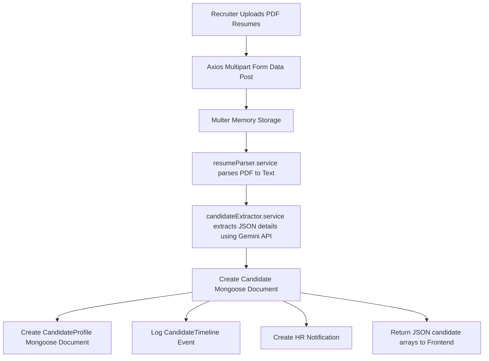

# HR Recruitment Platform - Project Documentation

## 1. Project Overview

The HR Recruitment Platform is a full-stack recruitment automation and applicant tracking system (ATS). It is built with a decoupled architecture consisting of an Express-based Node.js backend and a React-based frontend. 

### Key Capabilities
- **Candidate Management**: CRUD operations for candidates, categorized pipelines, and search/filter.
- **AI Resume Parser**: Automated PDF resume upload, text extraction, and metadata extraction (skills, experience, education, score) using the Google Gemini Pro API.
- **Hiring Workflow**: Multi-step candidate status transitions (`NEW` ➔ `CONTACTED` ➔ `INTERVIEW` ➔ `SELECTED` / `DROPPED` / `ON_HOLD`) with automated logging.
- **Audit Logs & Timelines**: Full audit trail of candidate status and profile updates, along with historical timeline events.
- **Task Management**: A Kanban task tracking system for recruiters.
- **Interview Scheduling**: Scheduler for telephone, video, onsite, technical, and HR interviews.
- **Notifications & Reports**: Analytics dashboard and notifications feed for recuiter actions.

---

## 2. Technology Stack

### Backend
- **Core Framework**: Node.js with **Express 5** (`express: ^5.2.1`) using ES Modules (`type: "module"`).
- **Database**: MongoDB via **Mongoose** (`mongoose: ^9.6.3`).
- **Authentication**: Role-Based Access Control (RBAC) powered by **JWT (JSON Web Tokens)** (`jsonwebtoken: ^9.0.3`) and **BcryptJS** (`bcryptjs: ^3.0.3`).
- **AI Integration**: **Google Gemini API** (`@google/generative-ai: ^0.24.1`) for parsing resumes.
- **PDF Parser**: `pdf-parse` (`^2.4.5`) to extract raw text from PDF files.
- **File Upload**: `multer` for in-memory multipart handling, and `cloudinary` / `multer-storage-cloudinary` for cloud-based resume storage.
- **Security & Logging**: `helmet` (security headers), `cors` (cross-origin sharing), `morgan` (HTTP request logging), and `express-validator` (input validation).

### Frontend
- **Core Library**: **React 19** (`react: ^19.2.0`) & **TypeScript** (`typescript: ^5.8.3`).
- **Build Tool**: **Vite** (`vite: ^7.3.1`).
- **Routing**: **React Router DOM** (`react-router-dom: ^7.1.5`) with client-side layout nesting and role guarding.
- **Data Fetching & Caching**: **TanStack React Query v5** (`@tanstack/react-query: ^5.83.0`) and **Axios** (`axios: ^1.16.1`).
- **UI Framework & Design**: **Tailwind CSS v4** (`tailwindcss: ^4.2.1`), **Radix UI** primitives for accessible components (Dialog, Tabs, Accordion, etc.), and **Lucide React** for icons.
- **Toasts & Forms**: `sonner` for notifications and `react-hook-form` with `zod` validation.
- **Data Visualization**: `recharts` (`^2.15.4`) for analytics graphs.

---

## 3. Project Directory Structure

Below is the complete text-based tree of the repository, updated to reflect the full structure of the frontend React pages, components, and backend modules.

```text
hr-recruitment-platform
├── PROJECT_DOCUMENTATION.md         # This file
├── PRODUCTION_READINESS_FIXES.md    # Log of recent resume upload fixes
├── README.md                        # Quick start overview
├── generate_tree.js                 # Script to generate project structure
├── project_summary.txt              # Auto-generated project summary
│
├── backend
│   ├── package.json                 # Backend scripts and dependencies
│   ├── src
│   │   ├── app.js                   # Express application setup
│   │   ├── server.js                # Server entrypoint and database connection
│   │   ├── config
│   │   │   └── database.js          # MongoDB Mongoose connection helper
│   │   ├── constants                # Centralized business logic enums
│   │   │   ├── callOutcomes.js
│   │   │   ├── candidateStatus.js
│   │   │   ├── dropReasons.js
│   │   │   ├── interestStatus.js
│   │   │   ├── roles.js
│   │   │   ├── timelineEvents.js
│   │   │   └── userRoles.js
│   │   ├── jobs                     # Scheduled background jobs (e.g. cron tasks)
│   │   ├── middleware               # Global route middlewares
│   │   │   ├── auth.middleware.js   # JWT verification middleware
│   │   │   ├── error.middleware.js  # Global error boundary
│   │   │   ├── role.middleware.js   # Role-based route protector
│   │   │   └── upload.middleware.js # Multer file upload configurations
│   │   ├── routes
│   │   │   └── index.js             # Core API router (binds all modules)
│   │   ├── scripts
│   │   │   └── createAdmin.js       # Database seeder for default users
│   │   ├── shared                   # Core utilities and standardized helpers
│   │   │   ├── errors
│   │   │   │   └── AppError.js      # Standardized custom error class
│   │   │   ├── logger
│   │   │   ├── response
│   │   │   │   └── apiResponse.js   # Standard success response formatter
│   │   │   ├── services
│   │   │   │   ├── audit.service.js # Logs audit changes to candidateAudit
│   │   │   │   ├── candidateCode.service.js # Generates candidate unique IDs
│   │   │   │   └── timeline.service.js      # Logs timeline events
│   │   │   └── utils
│   │   │       ├── asyncHandler.js  # Wraps async controllers to catch errors
│   │   │       ├── generateToken.js # Generates JWT access/refresh tokens
│   │   │       ├── pagination.js    # Utility for paginated DB queries
│   │   │       └── validateRequest.js # Validates express-validator schemas
│   │   └── modules                  # Domain-driven features
│   │       ├── activity
│   │       │   ├── activity.controller.js
│   │       │   ├── activity.routes.js
│   │       │   └── activity.service.js
│   │       ├── ai                   # AI integration controllers and services
│   │       │   ├── candidateExtractor.service.js # Calls Gemini API
│   │       │   ├── profileUpdater.service.js      # Builds CandidateProfile
│   │       │   └── resumeParser.service.js        # Extracts PDF text
│   │       ├── audits
│   │       │   └── candidateAudit.model.js        # CandidateAudit Mongoose schema
│   │       ├── auth
│   │       │   ├── auth.controller.js
│   │       │   ├── auth.model.js    # User Mongoose schema
│   │       │   ├── auth.routes.js
│   │       │   ├── auth.service.js
│   │       │   └── auth.validation.js
│   │       ├── calls
│   │       │   ├── call.controller.js
│   │       │   ├── call.model.js    # Call record schema
│   │       │   ├── call.routes.js
│   │       │   ├── call.service.js
│   │       │   └── call.validation.js
│   │       ├── candidates
│   │       │   ├── candidate.controller.js
│   │       │   ├── candidate.model.js # Candidate Mongoose schema
│   │       │   ├── candidate.routes.js
│   │       │   ├── candidate.service.js
│   │       │   ├── candidate.validation.js
│   │       │   ├── candidateDetails.controller.js # Full candidate overview
│   │       │   ├── candidateDetails.routes.js
│   │       │   ├── candidateDetails.service.js
│   │       │   ├── candidateStatus.service.js
│   │       │   ├── candidateWorkflow.controller.js
│   │       │   ├── candidateWorkflow.routes.js
│   │       │   └── candidateWorkflow.service.js
│   │       ├── dashboard
│   │       │   ├── dashboard.controller.js
│   │       │   ├── dashboard.routes.js
│   │       │   └── dashboard.service.js
│   │       ├── health
│   │       │   ├── health.controller.js
│   │       │   └── health.routes.js
│   │       ├── interviews
│   │       │   ├── interview.controller.js
│   │       │   ├── interview.model.js # Interview Mongoose schema
│   │       │   ├── interview.routes.js
│   │       │   ├── interview.service.js
│   │       │   └── interview.validation.js
│   │       ├── notifications
│   │       │   ├── notification.controller.js
│   │       │   ├── notification.model.js # Notification Mongoose schema
│   │       │   ├── notification.routes.js
│   │       │   └── notification.service.js
│   │       ├── profiles
│   │       │   └── candidateProfile.model.js # Detailed Candidate Profile schema
│   │       ├── reports
│   │       │   ├── report.controller.js
│   │       │   ├── report.routes.js
│   │       │   └── report.service.js
│   │       ├── resumes
│   │       │   ├── resume.controller.js
│   │       │   ├── resume.model.js
│   │       │   ├── resume.routes.js
│   │       │   └── resume.service.js
│   │       ├── search
│   │       │   ├── search.controller.js
│   │       │   ├── search.routes.js
│   │       │   └── search.service.js
│   │       ├── settings
│   │       │   ├── settings.controller.js
│   │       │   ├── settings.model.js # App Settings schema
│   │       │   ├── settings.routes.js
│   │       │   └── settings.service.js
│   │       ├── tasks
│   │       │   ├── task.controller.js
│   │       │   ├── task.model.js    # Task Mongoose schema
│   │       │   ├── task.routes.js
│   │       │   ├── task.service.js
│   │       │   └── task.validation.js
│   │       ├── timelines
│   │       │   └── candidateTimeline.model.js # CandidateTimeline schema
│   │       ├── uploads              # Local storage fallback directory
│   │       └── users
│   │           ├── user.controller.js
│   │           ├── user.routes.js
│   │           ├── user.service.js
│   │           └── user.validation.js
│   
└── frontend
    ├── package.json                 # Frontend dependencies and scripts
    ├── index.html                   # HTML template entrypoint
    ├── vite.config.ts               # Vite configurations
    ├── src
        ├── main.tsx                 # React DOM mount point
        ├── App.tsx                  # Main router setup and providers
        ├── index.css                # Global and component stylesheets
        ├── types
        │   └── index.ts             # TypeScript entity interfaces
        ├── lib
        │   ├── config.server.ts
        │   ├── error-capture.ts
        │   ├── error-page.ts
        │   ├── lovable-error-reporting.ts
        │   └── utils.ts             # Tailwind class merging utility
        ├── contexts
        │   └── AuthContext.tsx      # Auth State & Token persistence provider
        ├── hooks
        │   ├── use-mobile.tsx       # Detects mobile layouts
        │   └── useResumeUpload.ts   # Custom hook managing file upload state
        ├── layouts
        │   └── AppShell.tsx         # Sidebar, Topbar, & content wrapper layout
        ├── components
        │   ├── DashboardCard.tsx    # Summary widgets
        │   ├── Emptystate.tsx       # Null results placeholder
        │   ├── PageHeader.tsx       # Title bar with action buttons
        │   ├── Sidebar.tsx          # Navigation panel
        │   ├── StatusBadge.tsx      # Formats candidate pipeline status
        │   ├── Topbar.tsx           # Profile info and logout toggle
        │   ├── candidates
        │   │   ├── ResumeUploadDialog.tsx   # PDF dropzone dialog
        │   │   └── ResumeUploadProgress.tsx # Upload tracker list
        │   └── ui                   # Radix UI primitives & utility wrappers
        ├── services
        │   ├── http.ts              # Axios custom client with JWT interceptor
        │   ├── index.ts             # Main API service mapping (mock + http calls)
        │   ├── mock-data.ts         # Fake data database for offline mode
        │   └── resumeUploadService.ts # API calls for uploading resumes
        └── pages
            ├── Activity.tsx         # Audit logs feed
            ├── CandidateDetail.tsx  # Tabbed detail view (profile, logs, etc.)
            ├── Candidates.tsx       # Searchable candidate pipeline table
            ├── Dashboard.tsx        # High-level pipeline KPI dashboard
            ├── Interviews.tsx       # Interview schedule calendar list
            ├── Login.tsx            # Login credentials screen
            ├── Notifications.tsx    # Alerts feed
            ├── Reports.tsx          # Analytical graphs
            ├── Settings.tsx         # Application preferences (Account, Company)
            └── Tasks.tsx            # Recruiter Kanban board
```

---

## 4. How Everything is Connected

### 4.1 Authentication Flow
1. **Login**: User posts credentials (email & password) to `/api/auth/login`. 
2. **Tokens**: The backend validates with bcrypt and returns an `accessToken` (short-lived) and a `refreshToken` (saved in MongoDB on the `User` document).
3. **Frontend Storage**: On success, `AuthContext.tsx` stores both tokens in `localStorage` and transitions `isAuthenticated` to `true`.
4. **API Requests**: The custom Axios client in `frontend/src/services/http.ts` registers an interceptor. This interceptor injects the `Authorization: Bearer <accessToken>` header into all outgoing requests.
5. **Unauthorized Actions**: If an API returns a `401 Unauthorized` response (due to an expired access token), the interceptor automatically calls `/api/auth/refresh` to fetch a new access token. If that fails, it clears local storage and redirects the user to `/login`.
6. **Route Guarding**: The React Router in `frontend/src/App.tsx` wraps protected pages inside the `<RequireRole />` component, which checks login state and verifies role values (`ADMIN` vs. `HR`).

### 4.2 Candidate Intake & AI Resume Extraction Flow

1. **Upload**: The user uploads multiple PDF resume files through `ResumeUploadDialog.tsx`.
2. **API Call**: The files are packed into `FormData` and posted to `/api/candidates/upload-resumes`.
3. **Text Extraction**: The backend intercepts files using `multer`. The `resumeParser.service.js` parses the buffer into raw text using the `pdf-parse` engine.
4. **Gemini Extraction**: The raw text (truncated to 15,000 characters) is sent to `openaiResumeAnalyzer.service.js` (which is configured to use the **Google Gemini API**). Gemini processes the text and extracts a structured JSON response matching the candidate fields (skills, experience, education, score).
5. **Database Insertion**:
   - A `Candidate` document is created with standardized fields (`code`, `name`, `email`, `phone`, `category`, `status`, `aiAnalysis`).
   - A `CandidateProfile` document is created linking the candidate ID to detailed arrays of work history, certifications, projects, and parsed skills.
   - An event is logged to `CandidateTimeline` (`TIMELINE_EVENTS.RESUME_UPLOADED`).
   - A system `Notification` is created notifying the assigned HR.
6. **Response**: The frontend receives a list of successfully imported candidates and displays them in the pipeline.

### 4.3 Candidate Lifecycle & Auditing
- **Candidate Details page**: Querying a candidate's full profile calls `/api/candidates/:id`. The backend service `candidateDetails.service.js` uses `Promise.all` to concurrently query the `Candidate`, `CandidateProfile`, `Call`, `Interview`, `Task`, `CandidateTimeline`, and `CandidateAudit` models.
- **Workflow Transitions**: Changing a candidate's status (e.g. scheduling an interview or dropping a candidate) fires a transition service (`candidateWorkflow.service.js` or `candidateStatus.service.js`). These services update the candidate's `status` field, log the change to the `CandidateTimeline` model, and record the exact database field change (`fieldName`, `oldValue`, `newValue`, `changedBy`) in the `CandidateAudit` collection.

---

## 5. Issues & Incomplete Features (Gaps)

While the project builds successfully and the resume upload pipeline is production-ready, several significant structural and wiring gaps exist between the frontend and the backend.

### 5.1 Schema Field Naming Discrepancies
There are severe field mismatches between the database schemas and the TypeScript interfaces expected by the frontend pages. Because the backend returns raw Mongoose query documents, these fields do not align:

| Entity | DB Mongoose Field Name | Frontend TypeScript Expected Field | Impact on UI |
| :--- | :--- | :--- | :--- |
| **Audit Logs** | `fieldName` | `field` | Audit log field name column is empty |
| **Audit Logs** | `changedBy` (User ObjectId) | `updatedBy` (String) | Recruiter name column is empty |
| **Audit Logs** | `changedAt` | `timestamp` | Time column is empty / "—" |
| **Timeline** | `eventType` | `type` | Event category icon/color fails to render |
| **Timeline** | `performedBy` (User ObjectId) | `by` (String) | Actions default to "System" rather than the actual HR name |
| **Timeline** | `createdAt` (Mongoose standard) | `at` | Dates show up as "Invalid Date" or "—" |

> [!WARNING]
> **Resolution Required**: The frontend `candidateService.get(id)` function in `frontend/src/services/index.ts` does not map the returned backend arrays. A mapper function must be added to translate the database responses into frontend types.

### 5.2 Missing Backend Listing Endpoints
Several frontend pages require dashboard-wide lists, but the backend lacks query endpoints:
1. **Interviews Page**: The frontend calls `interviewService.list()` to fetch scheduled interviews. However, the backend router only defines `POST /api/interviews` and `PATCH /api/interviews/:id/complete`. There is **no endpoint to get all interviews** from the database.
2. **Tasks Page (Kanban)**: The frontend calls `taskService.list()` to construct the task lanes. The backend only defines creation, submission, and review endpoints. There is **no GET route to retrieve all tasks**.

### 5.3 Offline Service Mocking
Only the **Authentication** and **Candidate CRUD / Resume Upload** modules are connected to the live Express API. The remaining service functions in `frontend/src/services/index.ts` are completely mocked:
- `dashboardService.get()`: Returns static counters from `mock-data.ts`.
- `interviewService.list()` & `interviewService.create()`: Returns local array cache.
- `taskService.list()` & `taskService.updateStatus()`: Returns local array cache.
- `reportService.get()`: Generates random mathematical conversions for analytics charts.
- `notificationService.list()`, `markRead()`, & `markAllRead()`: Modifies local variables.

### 5.4 Analytical & Report Mismatches
- **Backend Analytics**: The backend `/api/reports` endpoints compute minimal information: total candidates, status counts, and the total count of candidates assigned to each HR.
- **Frontend Expectation**: The Reports page expects a single payload representing monthly trends (applied, interviewed, hired), source distribution (LinkedIn, Referrals, Naukri), and recruiter KPIs (counts of calls, interviews, and offers). The backend currently has no models or database collections tracking recruitment sources or recruiters' call/interview logs collectively.

### 5.5 Static Settings UI
- The settings panel on the frontend is entirely static. Forms under the "Company", "Resume", "Notifications", and "Preferences" tabs have hardcoded input values. Clicking "Save changes" triggers a static Success toast but does not make any PUT/PATCH request to the backend `/api/settings` endpoints.

---

## 6. Onboarding & Quick Start Guide

### 6.1 Prerequisites
- **Node.js**: v20 or higher.
- **MongoDB**: A running instance (local or Atlas cluster).
- **Gemini API Key**: Available from Google AI Studio.

### 6.2 Setup Commands

1. **Clone & Install Dependencies**:
   ```bash
   # Install Backend dependencies
   cd backend
   npm install
   
   # Install Frontend dependencies
   cd ../frontend
   npm install
   ```

2. **Configure Environment Variables**:
   Create a `.env` file inside the `backend/` folder:
   ```env
   PORT=5000
   MONGODB_URI=mongodb://localhost:27017/recruitment-platform
   JWT_ACCESS_SECRET=your_super_secret_access_key
   JWT_REFRESH_SECRET=your_super_secret_refresh_key
   GEMINI_API_KEY=AIzaSy...your_gemini_key
   
   # Optional: Cloudinary config for resume backups
   CLOUDINARY_CLOUD_NAME=your_cloud_name
   CLOUDINARY_API_KEY=your_api_key
   CLOUDINARY_API_SECRET=your_api_secret
   ```

3. **Database Seeding**:
   The backend automatically seeds default users on startup if `NODE_ENV` is not set to `production`. You can also manually seed the database:
   ```bash
   cd backend
   npm run seed:users
   ```

4. **Launch Local Servers**:
   ```bash
   # Terminal 1: Launch Backend API
   cd backend
   npm run dev
   # Runs on http://localhost:5000
   
   # Terminal 2: Launch Frontend App
   cd frontend
   npm run dev
   # Runs on http://localhost:5173
   ```

### 6.3 Default Seed Credentials
The database seeder prepares two roles for validation:

| Role | Username / Email | Password |
| :--- | :--- | :--- |
| **System Admin** | `admin@company.com` | `Admin@123` |
| **HR Recruiter** | `hr@company.com` | `Hr@123` |
